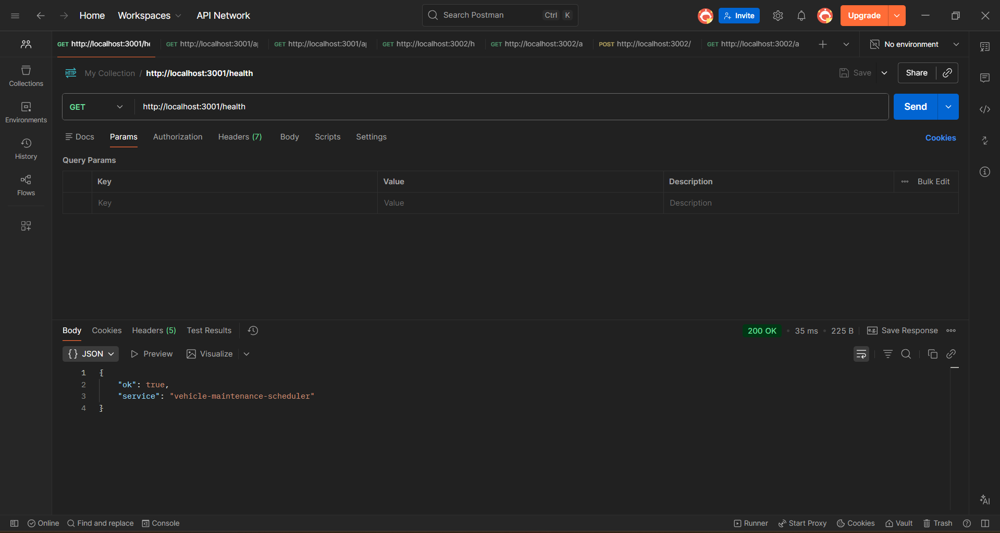
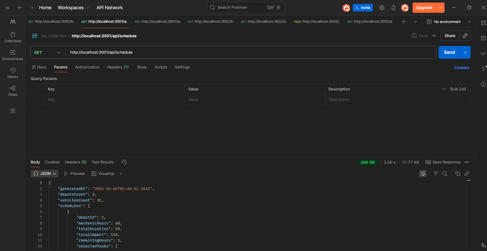
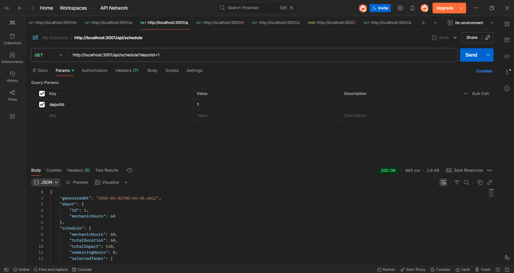
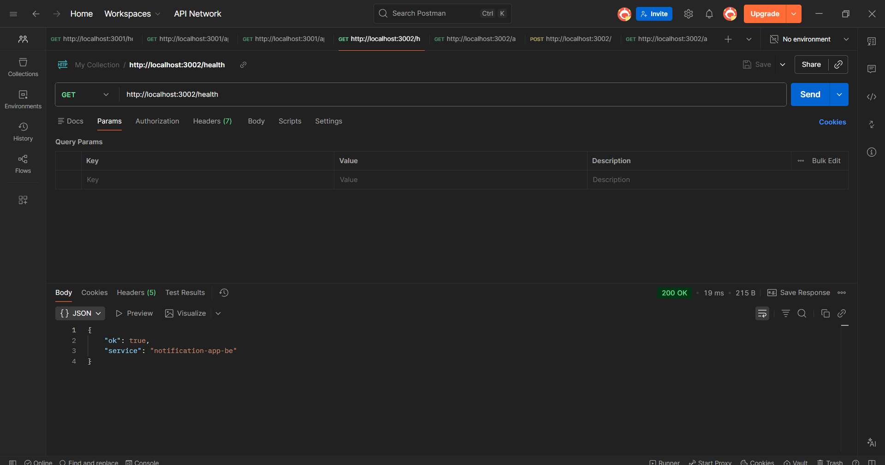
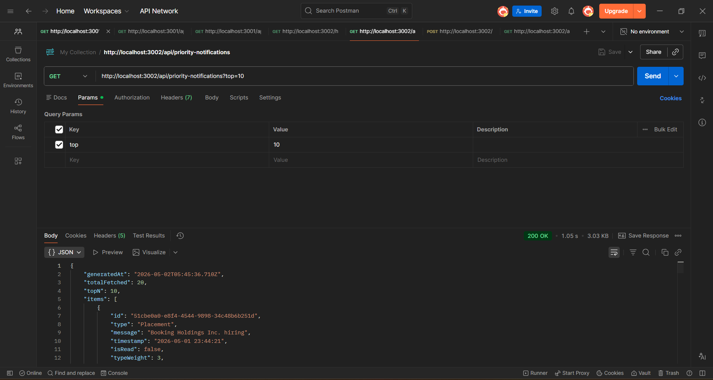
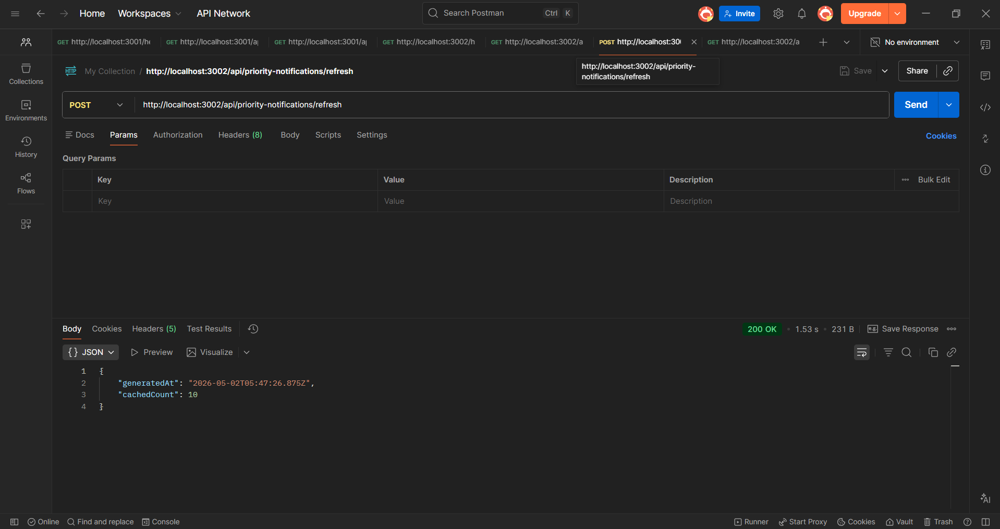
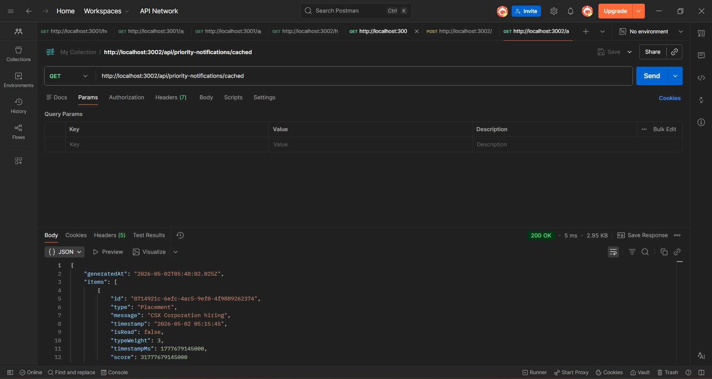

# Campus Hiring Backend Practice Project

This repository mirrors the backend track structure from the sample assessment:

- `logging_middleware/`
- `vehicle_maintenance_scheduler/`
- `notification_app_be/`
- `notification_system_design.md`

The code is intentionally written in plain, readable Node.js style so it is easy to explain in an interview.

## Prerequisites

- Node.js `18+` (tested on Node.js 24)

## Folder-by-folder run guide

### 1) Logging Middleware

No server runs here. This folder exports a reusable logger client used by the two backend apps.

### 2) Vehicle Maintenance Scheduler

```bash
cd vehicle_maintenance_scheduler
cp .env.example .env
node src/server.js
```

Default local URL: `http://localhost:3001`

### 3) Notification Backend (Stage 6)

```bash
cd notification_app_be
cp .env.example .env
node src/server.js
```

Default local URL: `http://localhost:3002`

## Important endpoints

Vehicle scheduler app:

- `GET /health`
- `POST /api/schedule`
- `GET /api/schedule?depotId=1`

Notification app:

- `GET /health`
- `GET /api/priority-notifications?top=10`

## Notes

- Both apps call the protected evaluation APIs by first generating a Bearer token using `/auth`.
- Credentials should be placed in each app's `.env` file.
- Logging middleware sends logs to `/logs` and supports the exact allowed stack/level/package values from the prompt.

## Evidence Screenshots

Vehicle scheduler API screenshots:





Notification API screenshots:





